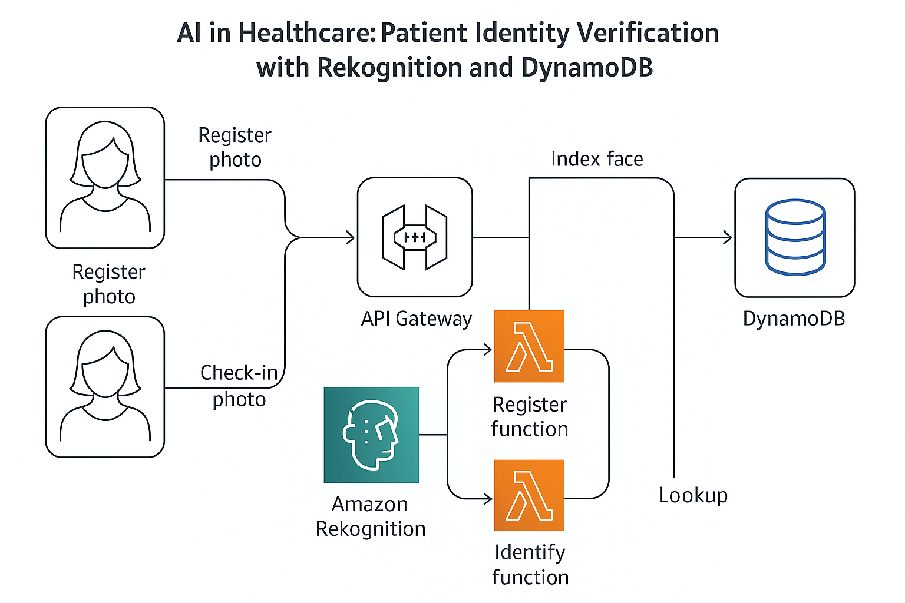

# Patient Identity Verification System

[](https://python.org/)
[](https://aws.amazon.com/lambda/)
[](LICENSE)

A serverless healthcare solution that uses Amazon Rekognition for facial recognition to streamline patient check-in processes. Built with AWS Lambda, API Gateway, and DynamoDB.

## Table of Contents
- [Overview](#overview)
- [Architecture](#architecture)
- [Features](#features)
- [Quick Start](#quick-start)
- [Installation](#installation)
- [Usage](#usage)
- [API Reference](#api-reference)
- [Contributing](#contributing)
- [License](#license)

## Overview

This project demonstrates a serverless patient identification system for healthcare facilities. Instead of relying on appointment numbers or ID cards, patients are identified instantly using facial recognition technology.

**Problem**: Healthcare facilities face delays and errors during patient check-in due to manual ID verification processes.

**Solution**: Automated facial recognition system that:
- Registers patients with their photo and demographic information
- Identifies returning patients instantly during check-in
- Reduces wait times and eliminates ID mismatches
- Maintains HIPAA compliance and data security

## Architecture



The system consists of two main workflows:

**Registration Flow:**
1. Patient photo + demographics → API Gateway
2. AWS Lambda processes image via Amazon Rekognition
3. Face data stored in Rekognition collection
4. Patient metadata stored in DynamoDB

**Identification Flow:**
1. Check-in photo → API Gateway
2. Lambda searches faces in Rekognition collection
3. Matched face_id retrieves patient data from DynamoDB
4. Returns patient information with confidence score

## Features

- **Facial Recognition**: 99%+ accuracy using Amazon Rekognition
- **Serverless**: Auto-scaling with pay-per-use pricing
- **HIPAA Compliant**: Secure data handling and encryption
- **Real-time**: Sub-second response times
- **RESTful API**: Easy integration with existing systems

## Quick Start

### Prerequisites
- AWS Account with appropriate permissions
- AWS CLI configured
- Python 3.9+

### 1-Minute Setup
```bash
# Clone the repository
git clone https://github.com/OluwaTossin/rekognition-patient-id.git
cd rekognition-patient-id

# Run the deployment script
chmod +x scripts/deploy.sh
./scripts/deploy.sh
```

## Installation

### Step 1: Create AWS Resources
```bash
# Create Rekognition collection
aws rekognition create-collection --collection-id cmc-patient-faces

# Create DynamoDB table
aws dynamodb create-table \
  --table-name cmc_patients \
  --attribute-definitions \
    AttributeName=patient_id,AttributeType=S \
    AttributeName=face_id,AttributeType=S \
  --key-schema AttributeName=patient_id,KeyType=HASH \
  --global-secondary-indexes \
    'IndexName=face_id-index,KeySchema=[{AttributeName=face_id,KeyType=HASH}],Projection={ProjectionType=ALL},ProvisionedThroughput={ReadCapacityUnits=5,WriteCapacityUnits=5}' \
  --provisioned-throughput ReadCapacityUnits=5,WriteCapacityUnits=5
```

### Step 2: Deploy Lambda Functions
```bash
# Create IAM role
aws iam create-role \
  --role-name lambda-rekognition-role \
  --assume-role-policy-document file://lambda-trust.json

aws iam put-role-policy \
  --role-name lambda-rekognition-role \
  --policy-name LambdaRekognitionPolicy \
  --policy-document file://lambda-policy.json

# Package and deploy functions
cd build-register && zip -r register_patient.zip register_patient.py
cd ../build-identify && zip -r identify_patient.zip identify_patient.py

# Deploy register function
aws lambda create-function \
  --function-name register-patient \
  --runtime python3.9 \
  --role arn:aws:iam::YOUR_ACCOUNT:role/lambda-rekognition-role \
  --handler register_patient.handler \
  --zip-file fileb://build-register/register_patient.zip \
  --environment Variables='{COLLECTION_ID=cmc-patient-faces,TABLE_NAME=cmc_patients}'

# Deploy identify function
aws lambda create-function \
  --function-name identify-patient \
  --runtime python3.9 \
  --role arn:aws:iam::YOUR_ACCOUNT:role/lambda-rekognition-role \
  --handler identify_patient.handler \
  --zip-file fileb://build-identify/identify_patient.zip \
  --environment Variables='{COLLECTION_ID=cmc-patient-faces,TABLE_NAME=cmc_patients,MATCH_THRESHOLD=95}'
```

## Usage

### Register a Patient
```bash
# Convert image to base64
IMG_B64=$(base64 -w 0 patient1.jpg)

# Register patient
curl -X POST "https://your-api-url/patients/register" \
  -H "Content-Type: application/json" \
  -d '{
    "patient_id": "P-1001",
    "attributes": {
      "name": "John Doe",
      "dob": "1985-06-15",
      "phone": "+1234567890"
    },
    "image_base64": "'$IMG_B64'"
  }'
```

### Identify a Patient
```bash
# Convert check-in image to base64
IMG_B64=$(base64 -w 0 patient1_checkin.jpg)

# Identify patient
curl -X POST "https://your-api-url/patients/identify" \
  -H "Content-Type: application/json" \
  -d '{
    "image_base64": "'$IMG_B64'"
  }'
```

## API Reference

### Base URL
```
https://your-api-id.execute-api.us-east-1.amazonaws.com/prod
```

### Register Patient
**Endpoint:** `POST /patients/register`

**Request:**
```json
{
  "patient_id": "P-1001",
  "image_base64": "/9j/4AAQSkZJRgABAQEAYABgAAD...",
  "attributes": {
    "name": "John Doe",
    "dob": "1985-06-15",
    "phone": "+1234567890"
  }
}
```

**Response:**
```json
{
  "patient_id": "P-1001",
  "face_id": "12345678-1234-1234-1234-123456789012",
  "status": "registered"
}
```

### Identify Patient
**Endpoint:** `POST /patients/identify`

**Request:**
```json
{
  "image_base64": "/9j/4AAQSkZJRgABAQEAYABgAAD..."
}
```

**Response:**
```json
{
  "patient_id": "P-1001",
  "name": "John Doe",
  "dob": "1985-06-15",
  "similarity": 97.85
}
```

## Contributing

1. Fork the repository
2. Create a feature branch (`git checkout -b feature/amazing-feature`)
3. Commit your changes (`git commit -m 'Add amazing feature'`)
4. Push to the branch (`git push origin feature/amazing-feature`)
5. Open a Pull Request

## License

This project is licensed under the MIT License - see the [LICENSE](LICENSE) file for details.